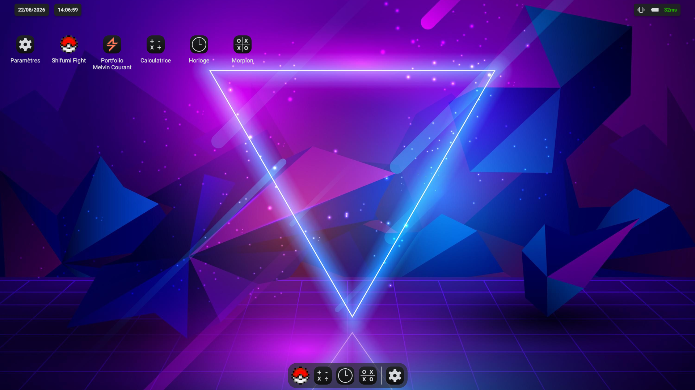

# Winmac OS

https://winmac-os.melvincourant.fr/

## Description

Development of a mini OS in a browser, based on a school project

## Tech stack

### Frontend
- [Vue 3](https://vuejs.org/)
- [Pinia](https://pinia.vuejs.org/) for state management
- [Vite](https://vite.dev/) for bundling and HMR
- [Sass](https://sass-lang.com/) for styling

### Tooling
- ESLint and Prettier

## Why I built this

This project was originally an assignment for my JavaScript course during my Master’s in Web Engineering. The goal? To create a mini OS that runs in a web browser, built entirely with vanilla JavaScript and leveraging Web APIs.

At the time, I was deeply passionate about this project and invested a lot of time into it. Today, I decided to modernize it by incorporating the skills I’ve gained since then, along with new features.

In doing so, I’ve given this project a second life, turning it into a more complete and personal version.